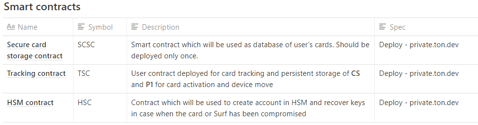

## 1. General information

This document describes in detail the process of TON Labs Security card delivery from the ordering to its activation by the user. The information about Recovery service is described in separate document.  

## 2. Security card details

Specification:

- Contactless card with a certified secure chip SE CC EAL 6+
- Single chip NFC-only design (iso14443)
- Infineon SLE78CAxx (protected from side-channel attack by design)
- Java OS (based on FT-JCOS)
- JavaCard Data Channel: GP SCP11C
- Free Space: >120K
- Hardware random number generator
- Private key never leaves the card
- Works with Multisig FVSC (Formally Verified Smart Contract)
- Open Source TON Labs SDK support
- Supported Platforms: Android 6.0+, iOS 13+

**1) Protection against substitution/tampering of cards during transfer from factory to User.**  User must be confident that card integrity was not broken during  transfer from factory and that card was not substituted or tampered by malware. 

**2) Authentication of user.** The card must  be confident that user interacting with the card is valid. 

**3) Man in the middle protection.** We want to protect the communication channel between card and Ton.Surf application. Some malware may be installed on smartphone, it may intercepts APDU commands from Ton.Surf, steal PIN code and try to make impersonation attack.

a) To solve 1) and 2) we implemented **two-factor authorization procedure based on** ***activation password (AP).*** 

b) Problem 3) was solved by HmacSha26 signing of all APDU data except keychain. The secret key for signature is elaborated based on ***common secret (CS)*** of card and TonSurf app that will never be transmitted in their communication channel. 

See the details below.

**Usage of common secret (CS) to protect all APDU commands against Man in the middle (MITM) attack**

**1)** APDU command VERIFY_PIN, commands to make signature ed25519 and all commands to handle card keychain are protected by signature HmacSha26. Input data for all these APDU commands have the following general format: **Data | Sault | HMAC(Data | Sault, Key)**, where **Sault** and **HMAC** have 32 bytes length. Adding of **HMAC** protects against MITM atack and helps to veify data integrity.

**2)** Sault — random 32-byted sequence elaborated by card. Before calling any APDU command the commad GET_SAULT must be called, it will provide fresh sault for host. Host must use only the sault taken from the card. Card verifies correctness of sault before verifiction of **HMAC**. If sault or **HMAC** are incorrect then an exception is thrown.

**3)** In applet there is a static counter that counts the number of fails to verify **HMAC(Data | Sault, Key)**. If 20 fails happened, applet  will be blocked. 

**4)** **Key** for **HMAC** is computed like **HMAC(CS, SHA256(Password))**. Since **CS** is not transmitted in the channel between card and **SA** then man in the middle will not be able to make impersonation attack.

Description of security card APDU commands:

Final list of APDU command supported by NFC card (will be added later).

At this step TonLabs secure card service (SC-service) will generate authentication data and save it to TonLabs secure card storage contract (SCSC) for future usage.

1. Check that SCSC is deployed in Mainnet (main.ton.dev)
2. With TonLabs Recovery service (RS) API generate values of *P1, IV, CS.*  
3. SC service evaluates and saves the following numbers in protoCard contract (each card has its own contract deployed) encrypted with TS secret key (TS_SK):
    - H1 - 32 bytes hash SHA256 of P1. We will use it to further calculation of the card number
    - **SN** - 24 bytes decimal representation of H1. This valued will be encoded into the barcode and printed on the side of the card
    - **B1** - 128 bytes encryption of P1. We will use AES128 CBC (Cipher Block Chaining)
    - H2 - 32 bytes hash SHA256 of B1
    - H3 - 32 bytes hash SHA256 of ECS
    - **ECS**, P1, IV
4. During deploy protoCard contracts SC service exports SN,B1,CS in base64 format to xml/csv file
5. xml/csv file is encrypted with PGP and sent over to card manufacturer 

Note that manufacturer can also obtain the numbers by itself by querying the same smart contract where those numbers would be encrypted with TS private key and Manufacturer public key.

## 4. Card order and delivery

**TonLabs Secure Card Service (SC Service) is** working with ShipHero API: 

1. User can order cards in [Ton.Surf](http://ton.Surf) or tonos-cli via DeBot. 
2. Ton.Surf deploys user's Tracking Smart Contract (TSC) via DeBot
3. DeBot checks that TSC is deployed and allows user to finish order**.** 
4. User provides a shipping address (encrypted) via TSC.
5. The main payment option is Ton Crystal, that will be charged from user's account. 
6. Payment by card is a second option. User enters payment information (bank card info, address of the user's TSC) and pays for secure card via our acquiring.
7. SC Service is sending to a courier provider internal shipping ID and the shipping address
8. The carrier scans the card and provides to SC Service Serial Number (SN) from the barcode on the card which has been sent to the corresponding shipping address. 
9. From this point the card strictly 

At this moment the service has: the address of the tracking contract,
The service requests:

- from the tracking contract U_PK
- from the corresponding protoCard contract - P1, CS and encrypts them with U_PK

 0.   SC Service deploy securityCard contract that prefilled with ecrypted (P1, CS )

1. SC Service links the received Serial Numbers and tracking number with the user's TSC (using the shipping ID)
2. SURF can get encrypted P1, CS, IV from the corresponding securityCard contract during card activation phase

SC-service checks for updates from ShipHero and sends it into user's TSC.

Note: SC service can identify secure card by its number (SN) inside TSC in case  user already have some number of secure cards.

### 5. Card Activation

Card activation procedure implement 2-way authorization protocol to determine that:

- Security Card integrity wasn't broken during delivery
- user which receives the security card is the same person who ordered the card

So, when user will get the secure card ****the following 2step procedure should be done (in this procedure description **'** mean that value of variable isn't authorized yet).

First step:

1. **SURF** asks card to output hash **H2'** of **B1'** that valid applet should know. 
2. **SURF** asks card to output hash **H3'** of **ECS'** that valid applet should know. 
3. User scans SN**'** printed on the card.
4. **SURF** sends **H3', H2'** into appropriate securityCard contract ***call requestCheckIntegrity)*** that emits ExtOutMessage (dst == SCSC_ADDRESS) to the SC service.
5. SC service checks  SN **== SN' && H2 == H2' && H3 == H3'**. 
6. If comparison of hashes is:
    - **TRUE** - SC service  get from protoCard contract IV and CS of user's secure card, encrypts them with user's public key (U_PK), signs by TS's private key (TS_SK) and puts result ****directly into the securityCard contract via SCSC
    - **FALSE** - Card integrity was broken during the transfer. SC service sends to SURF via securityCard contract  error message and mark in securityCard that card has CARD_VALIDATION_FAILED state

7. **SURF** takes IV, CS from securityCard contract. **After this step user is confident that card integrity was not broken during the transfer.**

Second step:

1. **SURF** asks a user to bring the security card to the device and input password (P1) then calls APDU command VERIFY_PASSWORD of Ton applet with input data **IV, P1** (recall that **VALID USER** already got **P1 in** **SURF** chat from **TSC**). ****
2. The **secure card** decrypts internal **B1** using passed **P1** and **IV**.  It compares the result of decryption and **P1** obtained from **Surf**.  If result of comparison:
    - **TRUE** - card supposes user is valid and applet mode is changed, now it' ready to work. SURF marks in TSC (through the securityCard contract) that card is activated (message should be signed both with SURF and secure card).
    - **FALSE** - card notify user about incorrect password (P1). User has 20 tries to input correct password.
3. If VERIFY_PASSWORD verification failed 20 times applet becomes blocked, only GET_APPLET_MODE command will be available and there is no way to unblock it. 

## 6. Deploy new multisig Wallet with 3 signatures (Recovery, Surf and Card) via SetCode procedure

1. Case: The surf is the sole custodian of the wallet. The card is added to surf and surf would like to convert 1-custodian multisig to 3-custodian multisig.

    1.1. call multisig function `submitUpdate` signed by surf keypair with the following arguments:

    - `codeHash` - representation hash of the tree of cells of the mulisig code (extract code from multisig tvc file).
    - `owners` - array of public keys of new custodians. There should be array of 3 elements [Surf_pubkey, Recovery_pubkey, Card_pubkey].
    - `reqConfirms` - required number of confirmations, should be 2. It means that 2/3 signatures are required to execute transaction in multisig.

    The function returns `updateId`.

    1.2. call `executeUpdate` signed by surf keypair with `updateId` from previous step. Use multisig code as `Cell` in `code` argument.

    Done. Multisig is updated.

2. Case: multisig wallet has 3 custodians: Recovery, Surf and Card. One of custodian's private key was lost or stolen or compromised. Need to update all custodians in multisig.
    1. call `submitUpdate` signed by one of multisig custodians (i.e. card). Use arguments as described in [1.1](https://www.notion.so/tonlabs/TonLabs-security-card-production-step-6cedb9ad6d0745c089afd47c988a98e7#58c5d900d5a3457ebf56622d54e5b834). Supply new array of custodian public keys. `submitUpdate` returns `updateId`.
    2. call `confirmUpdate` signed by another current custodian (i.e. Recovery) with `updateId` from above step.
    3. call `executeUpdate` signed by any of current custodians.

    Done. Multisig is updated.

In all cases multisig wallet address will not be changed.

## 7. Recovery via service

If the user use Recovery service and has lost either the Card or Device with Surf or Seed Phrase it can initiate a recovery procedure by logging into and signing a message with two remaining signatures to SetCode with only one castodian signature. Recovery service user flow described in separate document (link will be added later).

## 8. Recovery without service

When user don't use Recovery-service he(she) takes full responsibility for the safety of the keys. (more info will be added later)
